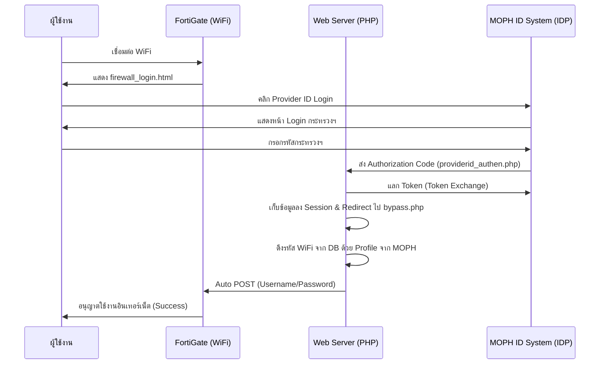

# FortiGate Firewall Login with MOPH Provider ID

ระบบยืนยันตัวตนสำหรับใช้งานอินเทอร์เน็ตผ่าน WiFi ของ FortiGate โดยเชื่อมต่อกับระบบ **MOPH Provider ID** (กระทรวงสาธารณสุข) เพื่ออำนวยความสะดวกให้บุคลากรสามารถเข้าใช้งานได้โดยใช้บัญชีกลางของกระทรวงฯ

## หลักการทำงาน (Workflow)

กระบวนการทำงานแบ่งออกเป็น 3 ส่วนหลัก ดังนี้:

### 1. หน้า Login (firewall_login.html)
หน้าเว็บนี้จะถูกนำไปอัปโหลดที่เมนู **Replacement Messages** บนเครื่อง FortiGate
*   **การเชื่อมต่อ**: เมื่อผู้ใช้งานเชื่อมต่อ WiFi ระบบจะแสดงหน้านี้
*   **ทางเลือก**: มี 2 วิธีในการเข้าใช้งาน:
    1.  กรอก Username/Password ปกติ (ส่งข้อมูลตรงไปยัง FortiGate)
    2.  คลิกปุ่ม **"เข้าสู่ระบบด้วย Provider ID"**
*   **เทคนิคพิเศษ**: มี Script ท้ายไฟล์ที่คอยเชื่อมโยงข้อมูล `state` สำหรับ OAuth โดยจะเติม `auth_posturl` (URL สำหรับส่งข้อมูลกลับหา Fortigate) ให้เป็น Absolute URL อัตโนมัติ เพื่อให้ระบบ Callback ทำงานได้ถูกต้อง

### 2. ระบบยืนยันตัวตน (providerid_authen.php)
ทำหน้าที่เป็น **Redirect URI** ที่ลงทะเบียนไว้กับทาง MOPH ID
*   **Step 1 (Receive Code)**: รับ `Authorization Code` จากหน้าล็อคอินของกระทรวงฯ
*   **Step 2 (Health ID Token)**: นำ Code ไปแลกเป็น `Access Token` ของ Health ID
*   **Step 3 (Provider ID Token)**: นำ Health ID Token ไปแลกเป็น `Provider ID Access Token` อีกครั้ง เพื่อให้ได้ข้อมูลสิทธิ์การใช้งานของบุคลากร
*   **Step 4 (Session Management)**: เก็บ Token และพารามิเตอร์ของ FortiGate (`auth_magicid`, `auth_redirid` ฯลฯ) ไว้ใน Session เพื่อใช้งานในขั้นตอนถัดไป

### 3. ระบบ Bypass และ Auto-Submit (bypass.php)
ทำหน้าที่รับข้อมูลจาก Session และทำการล็อคอินเข้าเครื่อง FortiGate ให้ผู้ใช้โดยอัตโนมัติ
*   **Step 1 (User Validation)**: นำข้อมูลโปรไฟล์ที่ได้จาก Provider ID (เช่น `hash_cid`) ไปตรวจสอบในฐานข้อมูลของโรงพยาบาล (`hospital_provider`) เพื่อหา Username/Password สำหรับเข้า WiFi
*   **Step 2 (Auto POST)**: สร้าง Form ลับที่บรรจุ Username/Password ของ WiFi และค่า `magic id` ของ FortiGate
*   **Step 3 (Final Auth)**: เมื่อหน้าเว็บโหลดเสร็จ จะมี JavaScript สั่ง `document.forms[0].submit()` ทันที เพื่อส่งข้อมูลไปยังเครื่อง FortiGate (`fgtauth`) ผู้ใช้งานจะได้เข้าเน็ตโดยไม่ต้องกรอกรหัสผ่านด้วยตัวเอง

---

## การติดตั้งและตั้งค่า

### 1. ตั้งค่าบน FortiGate
1.  ไปที่เมนู **System** -> **Replacement Messages**
2.  เลือก **Authentication** -> **Login Page**
3.  นำเนื้อหาจากไฟล์ `firewall_login.html` ไปวางแทนที่ของเดิม

### 2. ตั้งค่าบน Web Server (PHP)
1.  นำไฟล์ `providerid_authen.php` และ `bypass.php` ไปวางบน Server ที่สามารถเข้าถึงได้จากอินเทอร์เน็ต (ต้องมี HTTPS)
2.  **แก้ไขไฟล์ `firewall_login.html`**:
    *   ระบุ `client_id` ของคุณ
    *   ระบุ `redirect_uri` ให้ชี้ไปยังไฟล์ `providerid_authen.php`
3.  **แก้ไขไฟล์ `providerid_authen.php`**:
    *   ใส่ `[CLIENT_ID]` และ `[CLIENT_SECRET]` ของทั้ง Health ID และ Provider ID
    *   ระบุ `$dashboardUrl = "bypass.php";`
4.  **แก้ไขไฟล์ `bypass.php`**:
    *   เชื่อมต่อฐานข้อมูล `require("../kmls_config.php");` เพื่อดึงข้อมูลบัญชีผู้ใช้
    *   ระบุ IP ของ FortiGate ในส่วนของ `action="http://[IP_FORTIGATE]:1000?fgtauth?..."`

---

## แผนภาพการเชื่อมโยง (Diagram)

## ความปลอดภัย (Security)
*   ระบบมีการใช้ `state` พารามิเตอร์เพื่อป้องกันการปลอมแปลง (CSRF)
*   ข้อมูลรหัสผ่าน WiFi ถูกเก็บและส่งผ่านระบบภายในระหว่าง Server และ Firewall
*   ควรใช้งานผ่านโปรโตคอล **HTTPS** เสมอเพื่อความปลอดภัยของข้อมูลบุคลากร

---
### ผู้จัดทำ (Author)
**นายวิษณุ ศรีโยธา**
นักวิชาการคอมพิวเตอร์
กลุ่มงานสุขภาพดิจิทัล โรงพยาบาลกมลาไสย จังหวัดกาฬสินธุ์